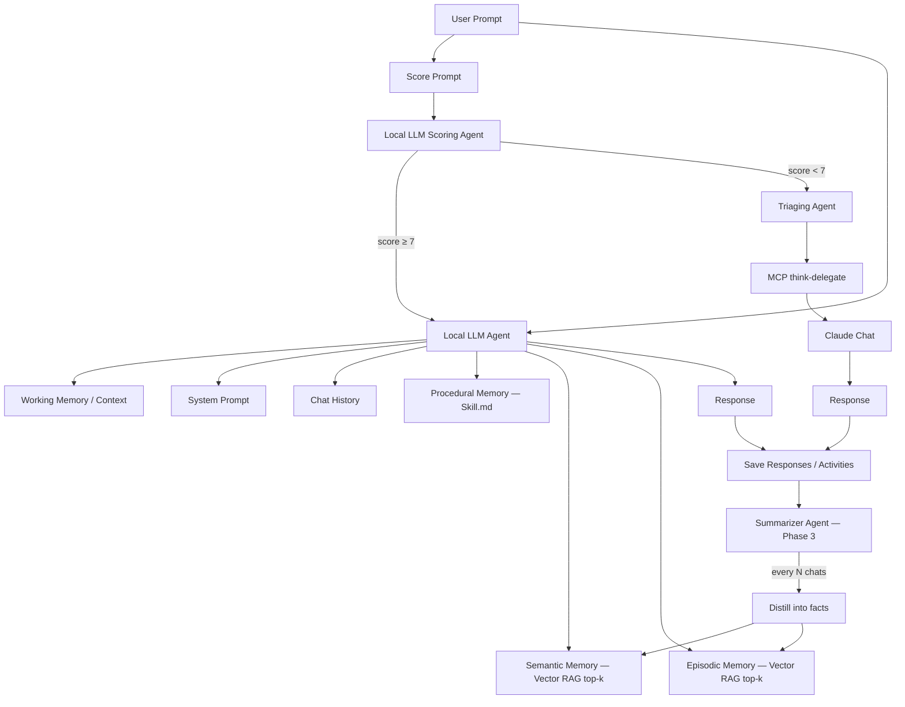

# Local Agent MCP

Hybrid **local-first LLM agent** built on [LM Studio](https://lmstudio.ai): MCP tool servers, prompt scoring/triage, vector RAG memory, and Claude CLI delegation for hard tasks.

All application code lives in [`lmstudio/`](./lmstudio/).

---

## Architecture

Full diagram (editable): **[Architecture_Daigram.excalidraw](./Architecture_Daigram.excalidraw)**



| Phase | Status | Component |
|---|---|---|
| **1** | Done | Scoring + auto-triage → Claude when below threshold |
| **2** | Done | Semantic + episodic vector stores, RAG top-k injection |
| **3** | Planned | Summarizer agent (every N chats → distill facts) |
| **4** | Planned | Procedural memory (`Skill.md` loader) |

---

## Quick start

```bash
cd lmstudio
./bootstrap.sh              # first-time setup
lms server start            # LM Studio API
lms load                    # load LLM + embedding model (for RAG)

uv run python agent/local_agent.py --root ~/Desktop
```

Install MCP servers into LM Studio:

```bash
cd lmstudio
uv run python scripts/install_to_lmstudio.py
```

Toggle servers in **LM Studio → Program → mcp.json**.

---

## Custom MCP servers

| Server | Phase | Doc |
|---|---|---|
| coding-tools | — | [coding-tools](./lmstudio/docs/servers/coding-tools.md) |
| web-tools | — | [web-tools](./lmstudio/docs/servers/web-tools.md) |
| think-delegate | — | [think-delegate](./lmstudio/docs/servers/think-delegate.md) |
| triage | 1 | [triage](./lmstudio/docs/servers/triage.md) |
| memory-rag | 2 | [memory-rag](./lmstudio/docs/servers/memory-rag.md) |
| docker-tools | — | [docker-tools](./lmstudio/docs/servers/docker-tools.md) |
| github-watch | — | [github-watch](./lmstudio/docs/servers/github-watch.md) |

Full index: [lmstudio/docs/SERVERS.md](./lmstudio/docs/SERVERS.md)

---

## OpenAI-compatible bridge

Optional stable endpoint for external clients (`local/current` always resolves to the loaded model):

```bash
cd lmstudio
uv run python agent/lmstudio_bridge.py   # http://127.0.0.1:8765/v1
curl http://127.0.0.1:8765/health
```

---

## Config

| File | Purpose |
|---|---|
| `lmstudio/config/triage.json` | Scoring thresholds |
| `lmstudio/config/memory.json` | RAG top-k, episodic auto-save |
| `lmstudio/mcp/mcp.json` | MCP server definitions (source of truth) |

---

## Branch note

OpenClaw / WhatsApp integration was moved to the **`archive/openclaw`** branch. Main focuses on LM Studio + local models only.
