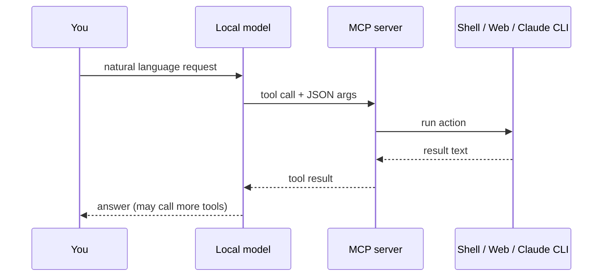

# LM Studio — MCP tools reference

Documentation for every MCP server and tool in this stack. No setup steps — only what exists, how to invoke it, and how it flows.

**Source:** custom servers in `servers/*.py` · bundled community servers via npx/uvx · config in `mcp/mcp.json`

---

## Custom servers (we built these)

| Server | Tools | Doc |
|---|---|---|
| **coding-tools** | 17 — filesystem, shell, python, node, git | [coding-tools](./docs/servers/coding-tools.md) |
| **web-tools** | 2 — fetch URL, web search | [web-tools](./docs/servers/web-tools.md) |
| **docker-tools** | 14 — containers, images, compose | [docker-tools](./docs/servers/docker-tools.md) |
| **think-delegate** | 3 — Claude CLI escalation | [think-delegate](./docs/servers/think-delegate.md) |
| **triage** | 3 — Phase 1 score + auto-route | [triage](./docs/servers/triage.md) |
| **memory-rag** | 6 — Phase 2 semantic + episodic RAG | [memory-rag](./docs/servers/memory-rag.md) |
| **procedural** | 3 — Phase 4 Skill.md loader | [procedural](./docs/servers/procedural.md) |
| **github-watch** | 8 — PR/issue CI polling | [github-watch](./docs/servers/github-watch.md) |

## Bundled community servers

| Server | Purpose | Doc |
|---|---|---|
| memory | Persistent key-value graph in `.agent-memory.json` | [memory](./docs/servers/memory.md) |
| codebase-memory | Code-aware long-term project memory | [codebase-memory](./docs/servers/codebase-memory.md) |
| git | Read-only git introspection | [git](./docs/servers/git.md) |
| time | Current time / timezone conversion | [time](./docs/servers/time.md) |
| context7 | Up-to-date library documentation lookup | [context7](./docs/servers/context7.md) |
| playwright | Browser automation | [playwright](./docs/servers/playwright.md) |
| sequential-thinking | Step-by-step reasoning scaffold | [sequential-thinking](./docs/servers/sequential-thinking.md) |
| github | Full GitHub API (optional, needs token) | [github](./docs/servers/github.md) |

Full index: [docs/SERVERS.md](./docs/SERVERS.md) · Cross-tool flows: [docs/TOOL-FLOWS.md](./docs/TOOL-FLOWS.md)

---

## How tool calling works here



The local model chooses a tool name and arguments. MCP runs the function and returns text. The model may chain multiple tools across turns.

---

## Quick reference — when to use which server

| Goal | Server | Tool(s) |
|---|---|---|
| Read or edit a file | coding-tools | `read_file`, `write_file`, `edit_file` |
| Search the codebase | coding-tools | `grep`, `find_files` |
| Run a command | coding-tools | `run_shell`, `run_python`, `run_node` |
| Commit changes | coding-tools | `git_commit` (+ `git_status` first) |
| Fetch a webpage | web-tools | `fetch_url` |
| Search the internet | web-tools | `web_search` |
| Hard bug / architecture | think-delegate | `deep_think` |
| Recent API / version info | think-delegate | `latest_knowledge` |
| Docker ops | docker-tools | `docker_ps`, `docker_run`, … |
| Watch a PR for CI updates | github-watch | `gh_watch` → `gh_poll` |
| Remember user prefs | memory | create/read entities |
| Browse a site interactively | playwright | navigate, click, snapshot |

---

## Sandbox rules (coding-tools)

All filesystem paths are resolved against **allowed roots** (default: `~/Desktop`). Paths outside the sandbox are rejected. Call `list_allowed_roots` first if unsure.

Shell commands matching destructive patterns (`rm -rf /`, `mkfs`, `dd if=`, etc.) are blocked.

---

## think-delegate pattern

Local model handles routine work. When stuck, it calls think-delegate → **Claude Code CLI** returns analysis → local model continues with coding-tools.

```
You ask → local model tries coding-tools
       → if stuck: deep_think(task, context)
       → Claude returns plan
       → local model: read_file / edit_file / run_shell to implement
```

See [think-delegate](./docs/servers/think-delegate.md) for parameters and flows.
