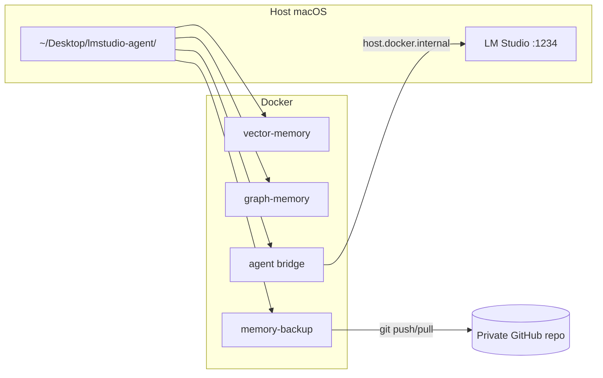

# Docker deployment

Run the LM Studio agent stack in containers with **Desktop bind mounts** for memory persistence and a **private GitHub repo** for disaster recovery.

## Architecture



| Container | Role | Desktop mount |
|---|---|---|
| `vector-memory` | Holds semantic + episodic SQLite | `memory/vector/` |
| `graph-memory` | Holds knowledge-graph JSON | `memory/graph/` |
| `agent` | Bridge + agent runtime (default: OpenAI proxy on `:8765`) | vector, graph, skills, workspace |
| `memory-backup` | Rsync + git commit/push every N seconds | `backup/` (git repo) |

LM Studio stays on the **host** (GPU, model loading, MCP GUI). Containers reach it via `host.docker.internal:1234`.

## One-time setup

### 1. Create Desktop volumes

```bash
./docker/scripts/init_desktop_volumes.sh
```

Creates `~/Desktop/lmstudio-agent/`:

```
~/Desktop/lmstudio-agent/
├── memory/
│   ├── vector/vector-memory.db    # Phase 2 RAG (semantic + episodic)
│   ├── graph/agent-memory.json    # Knowledge graph
│   └── skills/Skill.md            # Phase 4 procedural memory
├── workspace/                     # Agent coding sandbox
└── backup/                        # Local git mirror → private GitHub
```

### 2. Create a private GitHub repo

1. Create an **empty private** repo, e.g. `lmstudio-agent-memory`
2. Copy `docker/.env.example` → `docker/.env`
3. Set `MEMORY_BACKUP_GIT_REMOTE` (SSH recommended):

```bash
MEMORY_BACKUP_GIT_REMOTE=git@github.com:you/lmstudio-agent-memory.git
```

### 3. Start LM Studio on the host

```bash
lms server start
lms load    # LLM + text-embedding-nomic-embed-text-v1.5 for RAG
```

### 4. Build and run

```bash
docker compose -f docker/docker-compose.yml --env-file docker/.env up -d --build
```

Verify:

```bash
curl http://127.0.0.1:8765/health
docker compose -f docker/docker-compose.yml --env-file docker/.env ps
```

## Restore after data loss

On a new machine:

```bash
./docker/scripts/init_desktop_volumes.sh
./docker/scripts/memory_restore.sh git@github.com:you/lmstudio-agent-memory.git
docker compose -f docker/docker-compose.yml --env-file docker/.env up -d --build
lms server start && lms load
```

Memories are copied from the private repo back into Desktop bind mounts; the agent picks them up on restart.

## Commands

| Task | Command |
|---|---|
| Interactive agent | `docker compose ... run --rm agent agent` |
| Single task | `docker compose ... run --rm agent agent-task "fix the README"` |
| Manual backup push | `./docker/scripts/memory_backup.sh` |
| Restore from GitHub | `./docker/scripts/memory_restore.sh <remote-url>` |
| Logs | `docker compose -f docker/docker-compose.yml --env-file docker/.env logs -f agent` |

## Environment variables

See [`docker/.env.example`](../docker/.env.example).

| Variable | Default | Purpose |
|---|---|---|
| `LMSTUDIO_AGENT_DATA_ROOT` | `~/Desktop/lmstudio-agent` | All bind mounts |
| `LMSTUDIO_URL` | `http://host.docker.internal:1234` | LM Studio API |
| `MEMORY_BACKUP_GIT_REMOTE` | (empty) | Private repo URL |
| `BACKUP_INTERVAL_SEC` | `300` | Auto-sync interval |

Inside the agent container, paths are fixed:

- `VECTOR_MEMORY_DB=/data/memory/vector/vector-memory.db`
- `MEMORY_FILE_PATH=/data/memory/graph/agent-memory.json`
- `SKILLS_DIR=/data/memory/skills`
- `WORKSPACE_ROOTS=/data/workspace`

## Notes

- **MCP stdio servers** (LM Studio GUI) still run on the host via `install_to_lmstudio.py`. Docker covers the bridge, agent runtime, and memory persistence layer.
- SQLite is single-writer: only the `agent` container writes the vector DB; `vector-memory` and `graph-memory` are volume-holder sidecars with healthchecks.
- Keep the backup repo **private** — it contains conversation-derived memories and user facts.
