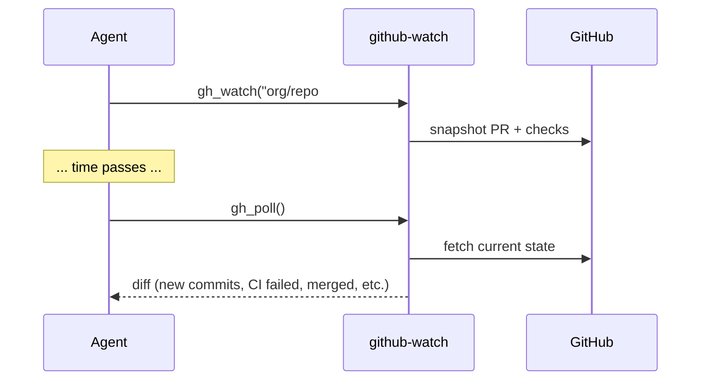

# Tool flows — LM Studio

End-to-end patterns for combining MCP tools. Each flow lists tools in order.

---

## 1. Explore and read a project

```
list_allowed_roots          → see sandbox
list_directory path=.       → browse
find_files pattern=*.py     → locate files
grep pattern=def main       → search content
read_file path=...          → read source
```

**When:** User asks “what’s in this project?” or “find where X is defined”.

---

## 2. Make a code change

```
read_file path=...                    → understand current code
edit_file path=... old=... new=...    → surgical replace
  — or —
write_file path=... content=...       → full rewrite
run_python code=...                   → quick verify
run_shell command=pytest ...          → run tests
git_status / git_diff                 → review
git_commit message=...                → commit
```

**When:** User asks to fix, add, or refactor code.

---

## 3. Debug with escalation

```
read_file / grep                      → gather local context
run_shell command=...                 → reproduce error
deep_think(
  task="Why does this race condition happen?",
  context="<stack trace + relevant code>",
  ultra=false
)                                     → Claude analyzes
edit_file / run_shell                 → apply fix locally
```

**When:** Local model is unsure about root cause or design.

---

## 4. Research then implement

```
latest_knowledge(
  question="What changed in FastMCP 2.x tool registration?",
  search_web=true
)                                     → Claude + web snippets
fetch_url url=<docs URL>              → verify primary source
read_file / write_file                → implement
```

**When:** Task depends on recent docs, versions, or APIs.

---

## 5. Web research

```
web_search query=...                  → DuckDuckGo results
fetch_url url=...                     → read full page as text
```

**When:** Need external information without Claude escalation.

---

## 6. Docker workflow

```
docker_ps                             → what's running
docker_logs container=...             → debug
docker_build path=... tag=...         → build image
docker_run image=... command=...      → run container
docker_compose action=up path=...     → compose stack
```

**When:** User works with containers. Blocklist prevents `docker run` with `--privileged` patterns.

---

## 7. GitHub PR awareness

```
gh_watch target=user/repo#42          → start watching
gh_poll                               → check all watches for deltas
gh_pr_status repo=... number=42       → one-shot PR + CI state
gh_workflow_runs repo=...             → Actions history
```

**When:** User cares about PR CI, reviews, or merge state over time.

**Flow:**



---

## 8. Memory across sessions

```
memory: create entities/relations     → store user prefs, project facts
(memory auto-recalled on next chat via system prompt + memory MCP)
```

**When:** User says “remember that I prefer …” or project-specific facts should persist.

**Complements:** codebase-memory for code-structure awareness.

---

## 9. Browser automation

```
playwright: navigate → snapshot → click → type
```

**When:** Need interactive JS-heavy pages coding-tools `fetch_url` cannot render.

---

## Combining servers

| Pattern | Servers |
|---|---|
| Local coding + expert review | coding-tools → think-delegate → coding-tools |
| Docs lookup + code | context7 → read_file → edit_file |
| Plan → execute | sequential-thinking → coding-tools |
| Read-only git audit | git (read) + coding-tools grep |
