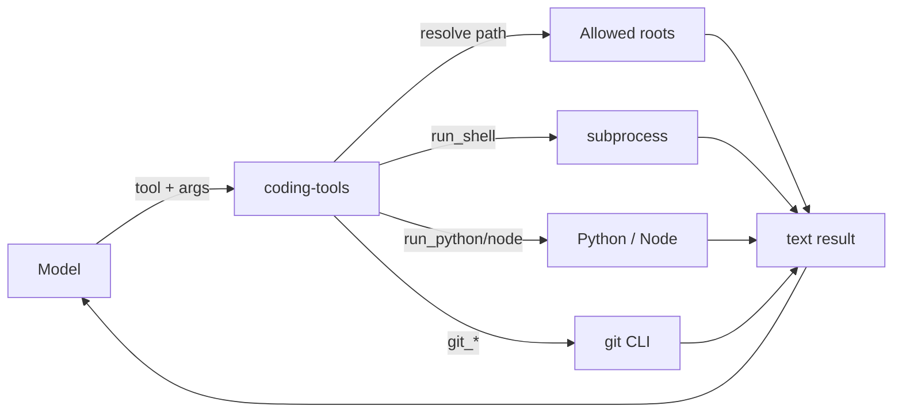

# coding-tools

**MCP server:** `coding-tools`  
**Source:** `servers/coding_tools.py`  
**Sandbox:** paths resolved under allowed roots (default `~/Desktop`)

Filesystem, shell execution, Python/Node snippets, and git — the primary agent toolkit.

---

## Flow



Every path is checked with `_resolve_in_sandbox` — escapes outside allowed roots return an error.

---

## Tools

### Filesystem

| Tool | Parameters | Returns |
|---|---|---|
| `list_allowed_roots` | — | Newline-separated allowed directory paths |
| `list_directory` | `path` (default `.`) | Entries; directories suffixed with `/` |
| `read_file` | `path`, `offset` (0), `limit` (0=all) | File text or error |
| `write_file` | `path`, `content`, `overwrite` (true) | Success or error |
| `edit_file` | `path`, `old_string`, `new_string`, `replace_all` (false) | Success or error |
| `create_directory` | `path` | Creates dir tree (mkdir -p) |
| `move_path` | `source`, `destination` | Moves/renames within sandbox |
| `delete_path` | `path` | Deletes file (not directories) |
| `find_files` | `pattern` (`*`), `path` (`.`), `max_results` (200) | Matching paths |
| `grep` | `pattern`, `path` (`.`), `glob` (`*`), `max_results` (200) | `file:line: content` matches |

### Execution

| Tool | Parameters | Notes |
|---|---|---|
| `run_shell` | `command`, `cwd` (`.`), `timeout` (60s) | Blocklist rejects destructive patterns |
| `run_python` | `code`, `cwd`, `timeout` | Runs snippet via `python -c` |
| `run_node` | `code`, `cwd`, `timeout` | Runs snippet via `node -e` |

**Blocked shell patterns (examples):** `rm -rf /`, `mkfs`, `dd if=`, `:(){ :|:& };:`, `chmod -R 777 /`, etc.

### Git

| Tool | Parameters | Notes |
|---|---|---|
| `git_status` | `cwd` (`.`) | Short status |
| `git_diff` | `cwd`, `staged` (false) | Diff output |
| `git_log` | `cwd`, `max_count` (10) | Recent commits |
| `git_commit` | `message`, `cwd`, `add_all` (true) | Stages all + commits |

---

## Usage examples

**Prompt → tool mapping (model decides):**

| User says | Typical tool chain |
|---|---|
| “List my Desktop” | `list_directory` path=`"."` |
| “Read README in lmstudio-agent-mcp” | `read_file` path=`lmstudio-agent-mcp/lmstudio/README.md` |
| “Find all Python files” | `find_files` pattern=`**/*.py` |
| “Where is deep_think defined?” | `grep` pattern=`def deep_think` |
| “Replace foo with bar in app.py” | `edit_file` |
| “Run tests” | `run_shell` command=`pytest` |
| “What's git status?” | `git_status` |

**Example tool call (read_file):**

```json
{
  "path": "lmstudio-agent-mcp/lmstudio/servers/coding_tools.py",
  "offset": 0,
  "limit": 50
}
```
