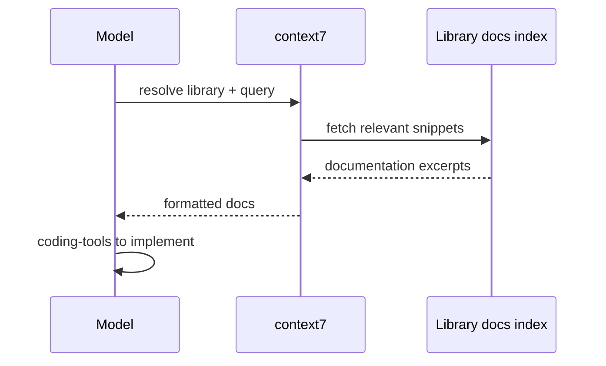

# context7

**MCP server:** `context7`  
**Package:** `@upstash/context7-mcp`

Up-to-date library and framework documentation lookup.

---

## Flow

---

## When to use

| Scenario | vs other tools |
|---|---|
| “How do I use FastMCP decorators?” | context7 — structured lib docs |
| Arbitrary webpage | web-tools `fetch_url` |
| Reasoning over recent changes | think-delegate `latest_knowledge` |

**Typical flow:** context7 → read official pattern → **coding-tools** `write_file` / `edit_file`
