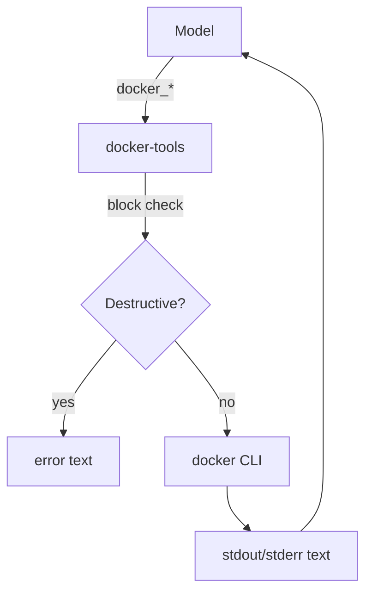

# docker-tools

**MCP server:** `docker-tools`  
**Source:** `servers/docker_tools.py`  
**Requires:** Docker daemon running locally

Docker Engine wrapper — list, run, build, logs, compose.

---

## Flow



Blocked: `--privileged`, mounting `/` or `/etc`, certain `docker run` patterns.

---

## Tools

| Tool | Parameters | Description |
|---|---|---|
| `docker_version` | — | Client + server version |
| `docker_ps` | `all_containers` (false) | Running (or all) containers |
| `docker_images` | — | Local images |
| `docker_inspect` | `target` | JSON inspect for container/image |
| `docker_logs` | `container`, `tail` (200) | Container logs |
| `docker_stats` | — | Live resource usage snapshot |
| `docker_run` | `image`, `command`, `detach`, `name`, `ports`, `volumes`, `env` | Run container |
| `docker_exec` | `container`, `command` | Exec command in running container |
| `docker_stop` | `container` | Stop container |
| `docker_start` | `container` | Start stopped container |
| `docker_rm` | `container`, `force` (false) | Remove container |
| `docker_rmi` | `image`, `force` (false) | Remove image |
| `docker_build` | `path`, `tag`, `dockerfile` ("") | Build image |
| `docker_pull` | `image` | Pull image |
| `docker_compose` | `action`, `path` (.), `services` ("") | compose up/down/ps/logs/etc. |

---

## Typical flows

**Inspect running stack:**

```
docker_ps → docker_logs container=my-app → docker_stats
```

**Build and run:**

```
docker_build path=./app tag=myapp:latest
docker_run image=myapp:latest ports=8080:8080 detach=true
```

**Compose:**

```json
{"action": "up", "path": "./deploy", "services": "api,db"}
```
