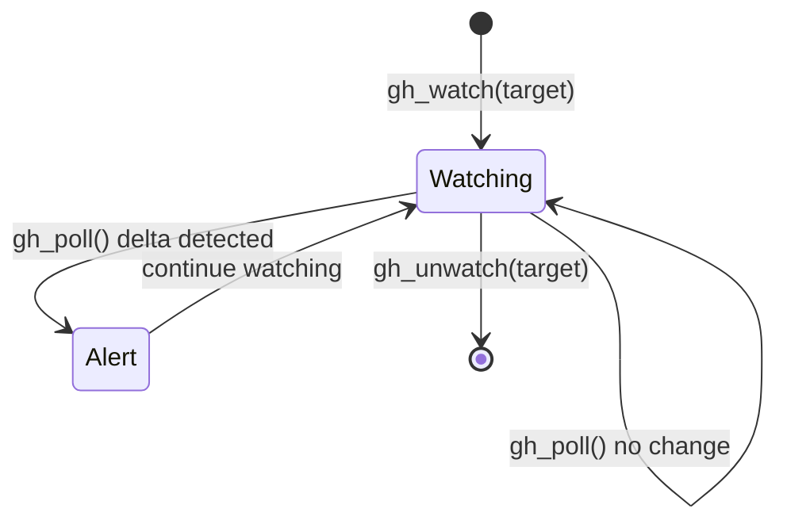

# github-watch

**MCP server:** `github-watch`  
**Source:** `servers/github_watch_tools.py`  
**Auth:** `GITHUB_PERSONAL_ACCESS_TOKEN` or `GITHUB_TOKEN`

Poll GitHub for PR/issue/repo changes — CI status, reviews, merges. Complements the official **github** MCP (which mutates/creates); this server is **watch + diff**.

---

## Flow



State persisted locally between polls. Each watch stores a signature (commits, checks, review state, labels, etc.).

---

## Tools

| Tool | Parameters | Description |
|---|---|---|
| `gh_watch` | `target` | Start watching — `user/repo#123` (PR/issue) or `user/repo` |
| `gh_unwatch` | `target` | Stop watching |
| `gh_list_watches` | — | Active watches |
| `gh_poll` | — | Poll all watches; return human-readable deltas |
| `gh_pr_status` | `repo`, `number` | One-shot PR state + CI checks |
| `gh_issue_status` | `repo`, `number` | One-shot issue state |
| `gh_workflow_runs` | `repo`, `branch` (""), `limit` (8) | Recent Actions runs |
| `gh_repo_activity` | `repo`, `limit` (10) | Recent pushes, PRs, releases |

---

## Target formats

| Format | Watches |
|---|---|
| `octocat/Hello-World#42` | Pull request or issue #42 |
| `octocat/Hello-World` | Repository activity |

---

## Usage flow

**Continuous awareness:**

```
gh_watch("priyansh19/lmstudio-agent-mcp#12")
... later ...
gh_poll()
```

**One-shot CI check:**

```json
{"repo": "priyansh19/lmstudio-agent-mcp", "number": 12}
```
→ `gh_pr_status`

---

## Example poll output

Reports changes like: new commits, CI failed/passed, review approved, merged, labels changed.

---

## vs github MCP

| github-watch | github |
|---|---|
| Watch + poll deltas | Create issues, PRs, search code |
| CI/review awareness | Full write API |
| Same token | Same token |
