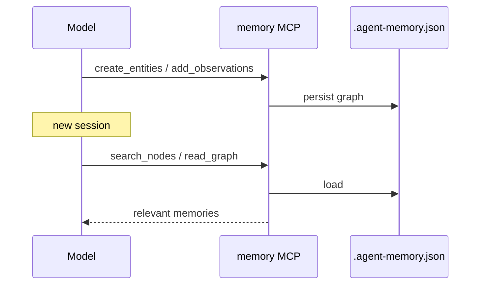

# memory

**MCP server:** `memory`  
**Package:** `@modelcontextprotocol/server-memory`  
**Storage:** `lmstudio/.agent-memory.json` (knowledge graph)

Persistent memory across chat sessions — entities, relations, observations.

---

## Purpose

Store facts the user wants remembered (preferences, project context, decisions). The memory MCP exposes standard graph operations (create/read/search entities and relations).

---

## When to use

| Scenario | Action |
|---|---|
| User: “Remember I prefer tabs over spaces” | Create entity/observation via memory tools |
| Next session: “What's my formatting preference?” | Search/read memory |
| Project-specific facts | Store as entities linked to project name |

---

## Flow

**Complements:** [codebase-memory](./codebase-memory.md) (code structure) · [think-delegate](./think-delegate.md) (reasoning, not storage)
