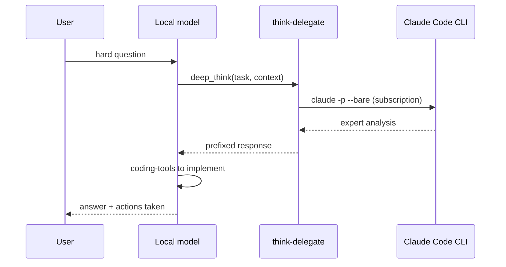

# think-delegate

**MCP server:** `think-delegate`  
**Source:** `servers/think_delegate.py`  
**Backend:** Claude Code CLI (subscription) by default — not Anthropic API

Escalates hard reasoning from the local model to a stronger expert. The expert returns **text only**; the local model continues with coding-tools to act on it.

---

## Flow



**Design principle:** Local SLM orchestrates. Expert advises. Local SLM executes file/shell/git operations.

---

## Tools

### `deep_think`

| Parameter | Type | Required | Description |
|---|---|---|---|
| `task` | string | yes | What to analyze or decide — be specific |
| `context` | string | no | Code, errors, constraints, background |
| `ultra` | bool | no | If true, uses deep model (default: opus) |

**Use for:** architecture, subtle bugs, security review, complex refactors, algorithm design.

**Example:**

```json
{
  "task": "Review this race condition in the bridge handler",
  "context": "Traceback: ...\n\nCode:\n...",
  "ultra": false
}
```

---

### `latest_knowledge`

| Parameter | Type | Required | Description |
|---|---|---|---|
| `question` | string | yes | What you need to know |
| `context` | string | no | Why you need it, what you're building |
| `search_web` | bool | no | Default true — DuckDuckGo search before expert |

**Use for:** post-cutoff facts, current library versions, recent API changes.

**Flow when `search_web=true`:**

```
web_search(question) → snippets appended to prompt → Claude synthesizes answer
```

---

### `delegate_status`

No parameters. Returns provider, model names, Claude CLI availability, env config.

**Use when:** delegation failed or user asks if escalation is available.

---

## Environment (runtime)

| Variable | Default | Effect |
|---|---|---|
| `THINK_PROVIDER` | `claude-cli` | `claude-cli`, `anthropic`, or `openai` |
| `THINK_MODEL` | `sonnet` | Standard tier |
| `THINK_DEEP_MODEL` | `opus` | Used when `ultra=true` |
| `THINK_USE_SUBSCRIPTION` | `1` | Strips API keys so CLI uses subscription |
| `CLAUDE_CLI_TIMEOUT` | `300` | Subprocess timeout seconds |

---

## Usage patterns

| Local model situation | Call |
|---|---|
| User asks “design the auth system” | `deep_think` ultra=true |
| Test failure unclear | `deep_think` + paste traceback in context |
| “What's the current MCP SDK API?” | `latest_knowledge` |
| Delegation error | `delegate_status` |

**Prompt examples:**

- *“Use deep_think to analyze this deadlock — here's the code…”*
- *“Use latest_knowledge: what changed in OpenAI tool schemas?”*
