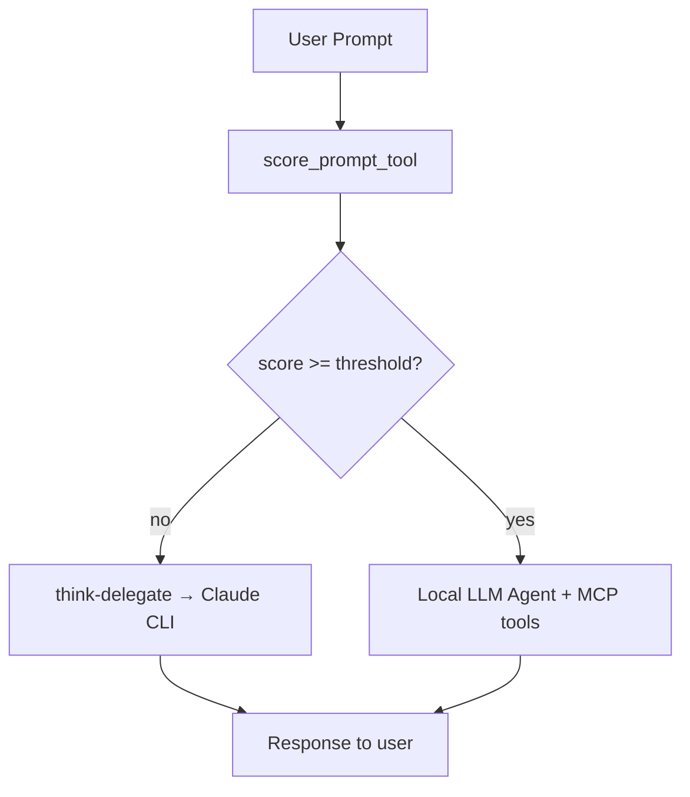

# triage — Phase 1 scoring + auto-triage

**MCP server:** `triage`  
**Source:** `servers/triage_tools.py` + `agent/triage_core.py`  
**Config:** `config/triage.json`

Implements the scoring and triaging flow from `Architecture_Daigram.excalidraw`.

---

## Flow



Default **threshold: 7.0** (score ≥ 7 → local, &lt; 7 → Claude).  
Scores **&lt; 4** use **opus** (`ultra` mode).

---

## Tools

| Tool | Description |
|---|---|
| `score_prompt_tool` | Score only (0–10 JSON), no delegation |
| `triage_request` | Score + auto-delegate if below threshold |
| `triage_status` | Show config |

---

## Where triage runs automatically

| Host | Behavior |
|---|---|
| **`local_agent.py`** | Before each turn (disable: `--no-triage`) |
| **`lmstudio_bridge.py`** | Before bridge chat completions (config: `bridge_triage`) |
| **LM Studio MCP** | Model calls `triage_request` manually |

---

## Configuration

`config/triage.json`:

```json
{
  "enabled": true,
  "threshold": 7.0,
  "ultra_threshold": 4.0,
  "lmstudio_url": "http://127.0.0.1:1234",
  "bridge_triage": true
}
```

Environment overrides: `TRIAGE_ENABLED`, `TRIAGE_THRESHOLD`, `LMSTUDIO_URL`

---

## Example

```json
{"user_prompt": "Design a distributed cache invalidation system", "context": "Go microservices"}
```

Low score → Claude responds via `think-delegate`.

---

## Phase 2 (next)

Semantic + episodic vector memory with RAG top-k injection.
