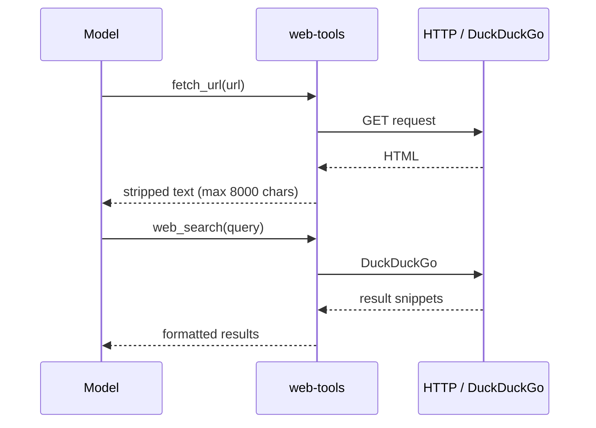

# web-tools

**MCP server:** `web-tools`  
**Source:** `servers/web_tools.py`  
**Auth:** none (keyless)

Fetch web pages as plain text and search DuckDuckGo.

---

## Flow



---

## Tools

| Tool | Parameters | Behavior |
|---|---|---|
| `fetch_url` | `url`, `max_chars` (8000) | HTTP GET → strip HTML tags → truncate |
| `web_search` | `query`, `max_results` (5) | DuckDuckGo search → title + snippet + URL per result |

---

## When to use

| Scenario | Tool |
|---|---|
| Read documentation page | `fetch_url` |
| Find links on a topic | `web_search` |
| Verify facts before coding | `web_search` then `fetch_url` on best URL |

**vs think-delegate:** Use `latest_knowledge` when the model needs synthesis + reasoning over search results. Use `web_search` alone for quick lookups the local model can interpret.

---

## Usage examples

```json
{"url": "https://docs.python.org/3/library/asyncio.html", "max_chars": 6000}
```

```json
{"query": "FastMCP tool registration 2025", "max_results": 5}
```

**Prompt examples:**

- *“Fetch https://example.com and summarize”*
- *“Search the web for LM Studio MCP configuration”*

---

## Limitations

- `fetch_url` returns stripped text — no JavaScript rendering (use **playwright** for that).
- Some sites block automated requests or return errors; tool returns the error message as text.
