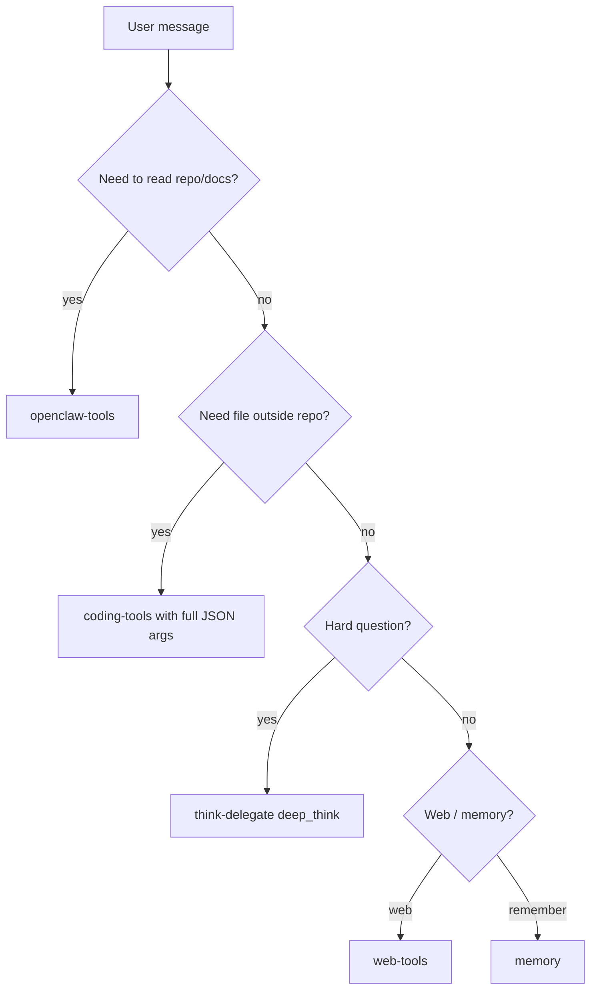

# OpenClaw — MCP tools reference

Documentation for MCP tools available in the **OpenClaw / WhatsApp** profile. No setup steps — only what exists, how to invoke it, and how it flows.

**OpenClaw-only server:** `servers/openclaw_tools.py`  
**Shared servers (same code as LM Studio):** `../lmstudio/servers/` — coding-tools, web-tools, think-delegate, memory

Profile definition: `mcp/profile.json`

---

## Servers in the WhatsApp profile

| Server | Tools exposed | Doc |
|---|---|---|
| **openclaw-tools** | 8 — zero-arg reads (use first) | [openclaw-tools](./docs/servers/openclaw-tools.md) |
| **coding-tools** | 5 — filtered subset | [coding-tools](./docs/servers/coding-tools.md) |
| **think-delegate** | 3 — Claude escalation | [think-delegate](./docs/servers/think-delegate.md) |
| **web-tools** | 2 — fetch + search | [web-tools](./docs/servers/web-tools.md) |
| **memory** | MCP memory graph | [memory](./docs/servers/memory.md) |

**Disabled in profile:** playwright, docker-tools (too heavy / risky for phone-triggered agents)

Index: [docs/SERVERS.md](./docs/SERVERS.md) · Flows: [docs/TOOL-FLOWS.md](./docs/TOOL-FLOWS.md)

---

## Tool selection flow (small models)

Gemma and similar models often fail when calling tools with **empty arguments** `{}`. Follow this order:



### Rules

1. **Prefer openclaw-tools** for README, SETUP, catalog, repo listing, repo grep — no required args.
2. **coding-tools__read_file** requires `{"path": "..."}` — never `{}`.
3. **think-delegate** for architecture, bugs, or current facts the local model cannot answer.
4. **web-tools** when you need an arbitrary URL or open web search.

Workspace rules template: [prompts/workspace-tools.md](./prompts/workspace-tools.md)

---

## Tool name format in OpenClaw

OpenClaw prefixes tools with the server name:

```
openclaw-tools__read_readme
coding-tools__read_file
think-delegate__deep_think
web-tools__fetch_url
```

Example user message: *"Use openclaw-tools read_readme"*

---

## Shared vs OpenClaw-only

| | openclaw-tools | coding-tools |
|---|---|---|
| Scope | This repo only | Any path in sandbox |
| Args | Zero or optional defaults | Required for most tools |
| Best for | Gemma / WhatsApp | Paths you construct explicitly |

Full coding-tools reference (all 17 tools): [../lmstudio/docs/servers/coding-tools.md](../lmstudio/docs/servers/coding-tools.md)
