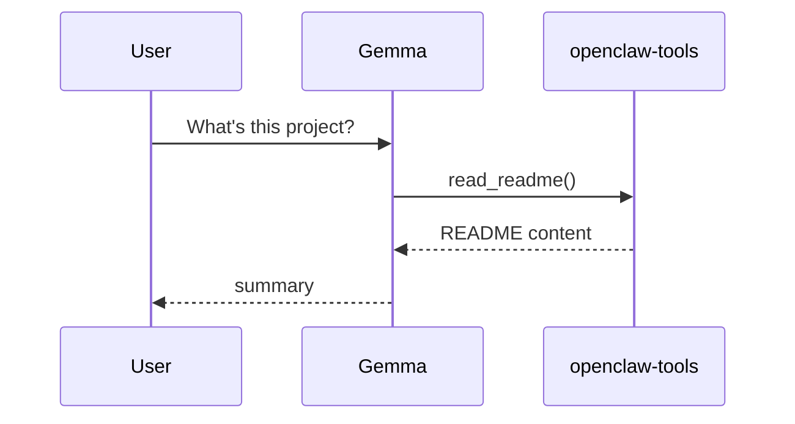

# Tool flows — OpenClaw

Patterns for WhatsApp / small-model agents. Prioritize **openclaw-tools** to avoid empty-argument failures.

---

## 1. Read project documentation

```
openclaw-tools__list_repo           → see files
openclaw-tools__read_readme         → README
openclaw-tools__read_setup_guide    → SETUP.md
openclaw-tools__read_catalog        → CATALOG.md
openclaw-tools__read_doc            → any doc (optional filename)
```

**Flow:**



---

## 2. Search the repo

```
openclaw-tools__grep_repo pattern=think-delegate
openclaw-tools__read_repo_file relative_path=servers/think_delegate.py
```

Default pattern for `grep_repo` is `"think-delegate"` if model sends `{}`.

---

## 3. Read a sandbox file (not in repo)

Requires **coding-tools** with explicit path:

```json
{"path": "some-other-folder/file.txt"}
```

Never call `coding-tools__read_file` with `{}`.

---

## 4. Hard question on WhatsApp

```
think-delegate__deep_think
  task: "Explain why tool calls fail with empty args"
  context: "<error message>"
```

Local Gemma gets Claude’s answer and summarizes for the user.

---

## 5. Look something up on the web

```
web-tools__web_search query=OpenClaw MCP toolFilter
web-tools__fetch_url url=https://...
```

---

## 6. Remember something

Use **memory** MCP tools to create/update entities when the user asks to remember preferences.

---

## Failure modes

| Symptom | Cause | Fix |
|---|---|---|
| Validation error before tool runs | `{}` args to coding-tools | Use openclaw-tools instead |
| Empty read | Wrong sandbox path | `list_allowed_roots`, paths relative to `~/Desktop` |
| think-delegate timeout | Claude CLI slow | Retry with shorter `context` |

---

## Recommended tool order per message type

| User intent | First tool |
|---|---|
| “What is this repo?” | `openclaw-tools__read_readme` |
| “List files” | `openclaw-tools__list_repo` |
| “Search for X in repo” | `openclaw-tools__grep_repo` |
| “Read file Y in repo” | `openclaw-tools__read_repo_file` |
| “Read file on Desktop” | `coding-tools__read_file` + path |
| “Why doesn’t this work?” | `think-delegate__deep_think` |
| “Latest news on X” | `web-tools__web_search` or `think-delegate__latest_knowledge` |
