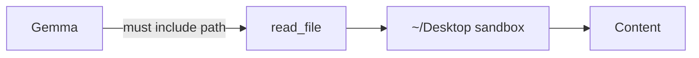

# coding-tools (OpenClaw profile)

**MCP server:** `coding-tools` (filtered)  
**Source:** `../lmstudio/servers/coding_tools.py`

Same server as LM Studio, but OpenClaw exposes **5 tools only**:

| Tool | Required parameters |
|---|---|
| `list_allowed_roots` | none |
| `list_directory` | `path` optional (default `.`) |
| `read_file` | **`path` required** |
| `grep` | `pattern` required |
| `find_files` | `pattern` optional |

---

## Flow



---

## Critical rule

**Never invoke `coding-tools__read_file` with `{}`.** Gemma does this often → validation error.

Use **openclaw-tools** for repo reads, or pass explicit JSON:

```json
{"path": "lmstudio-agent-mcp/lmstudio/README.md"}
```

Paths are relative to sandbox root (`~/Desktop` by default).

---

## Tool details

Full parameter reference for all 17 tools: [../../lmstudio/docs/servers/coding-tools.md](../../lmstudio/docs/servers/coding-tools.md)

OpenClaw does **not** expose: `write_file`, `edit_file`, `run_shell`, `git_*`, etc. in the WhatsApp profile.

---

## Example flows

**Browse Desktop:**

```
list_allowed_roots → list_directory path="." → read_file path="myfile.txt"
```

**Search then read:**

```
grep pattern="bridge" path="lmstudio-agent-mcp"
read_file path="lmstudio-agent-mcp/lmstudio/agent/lmstudio_bridge.py" limit=80
```
