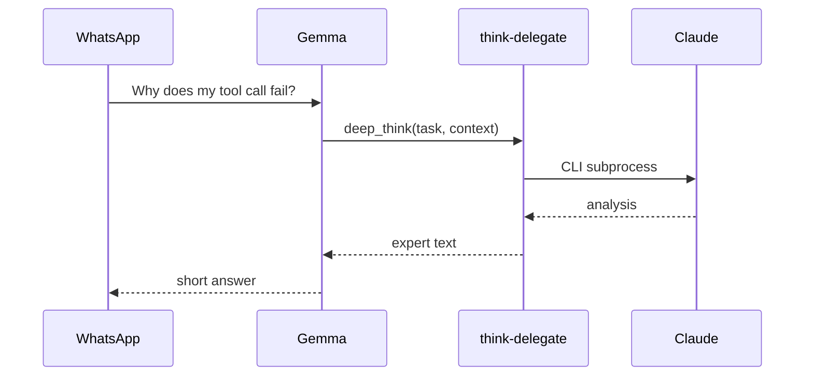

# think-delegate (OpenClaw)

**MCP server:** `think-delegate`  
**Source:** `../lmstudio/servers/think_delegate.py`

Identical tools and behavior to LM Studio. WhatsApp user asks → Gemma delegates → Claude CLI answers → Gemma summarizes.

---

## Tools

| Tool | Use on WhatsApp |
|---|---|
| `deep_think` | User asks architecture, debugging, complex “why” |
| `latest_knowledge` | Current APIs, recent events, version questions |
| `delegate_status` | “Is Claude connected?” / after failures |

Full reference: [../../lmstudio/docs/servers/think-delegate.md](../../lmstudio/docs/servers/think-delegate.md)

---

## Flow



Gemma typically does **not** chain coding-tools after on WhatsApp — it returns Claude’s summary to the user.

---

## Example

```json
{
  "task": "Explain empty argument validation errors in OpenClaw MCP",
  "context": "Error: tool coding-tools__read_file requires path"
}
```

OpenClaw name: `think-delegate__deep_think`
